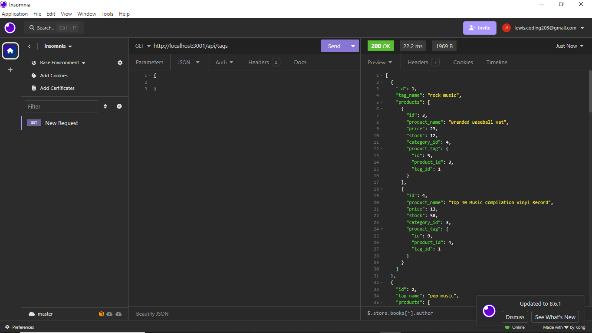

# e-commerce-back-end

## Description
This project is an exercise in object relational mapping. It is an mock E-Commerce backend. This helped me better learn how to set up models for database objects. It also helped me learn routing for a RESTful application.

## Usage
To use this application, you first have to either clone the repository or get a zip file of it. Once you have the repository on your machine you have to install the modules in the package.json. You'll then have to source the db with mysql. After the database is sourced you can run npm start and run the server. Once that's done you'll have to use an application like insomnia to access the database information, and test the routing.

[Video Demonstration](https://drive.google.com/file/d/1wP6-2ldBb6q5a4XrC8l9gq-bHSU1410C/view)